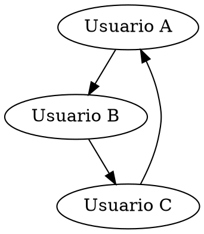

# Manual Técnico del Sistema de Gestión de Red Social

Este documento proporciona detalles técnicos sobre el sistema de gestión de red social, incluyendo la estructura del código, la lógica detrás de las funcionalidades principales y la forma en que se gestionan los datos. Está dirigido a desarrolladores que desean entender, mantener o expandir el sistema.

## Requisitos Técnicos

- **Lenguaje de programación:** C++
- **Compilador recomendado:** TDM-GCC 9.2.0 / MinGW / Dev-C++ o Qt (de preferencia)
- **Entorno de desarrollo:** Qt
- **Herramientas adicionales:**
  - [Graphviz](https://graphviz.org/): Para la generación de gráficos en formato `.dot`.

## Estructura del Proyecto

El presente es la fase 2 del proyecto del curso Estructura de Datos, dicho proyecto conserva algunas estructuras de la fase anterior, sin embargo otras fueron modificadas y otras agregadas. La principal diferencia entre esta fase y la anterior es la interfaz gráfica.

Para la realización del proyecto se hizo uso del framework conocido como `Qt`, lo cual permite brindarle al usuario una interfaz más amigable y simple de entender.

El proyecto está dividido en múltiples archivos para mejorar la modularidad y organización, sin embargo a continuación se definen los más importantes:

- **`main`:** Es el archivo main, por medio de este se accede a la interfaz de inicio del programa llamada ModuloEntrada.

- **`ModuloEntrada`:** Es el archivo encargado de mostrar el login del programa, en este se tiene la opción de ingresar como usuario, administrador o incluso crearse una cuenta por medio de una de sus opciones.

- **`RegistroUsuario`:** Este registro le permite al usuario registrarse en el programa, siempre y cuando se completen todos los campos, al registrar un usuario este se almacena en un árbol avl el cual contiene a todos los usuarios del sistema.

Una vez definida la parte general programa se explicará la función de los dos módulos principales para el buen funcionamiento del programa:

#### Modulo Administrador
Dicho módulo fue programado para el uso exclusivo del administrador de la red social. A dicho módulo se puede acceder por medio de las credenciales **`Correo: admin@gmail.com`** y con contraseña **`contraseña: EDD2S2024`**. Al momento de ingresar el administrador tiene diferentes espacios y funciones con los que puede interactuar, espacios que serás descritos a continuación:


##### Buscar
Este apartado tiene como fin mostrar a los usuarios disponibles en el sistema (los usuarios almacenados en el árbol avl). Al ingresar al módulo se podrán observar todos los usuarios disponibles en una tabla, dicha tabla contiene opciones, la de modificar y eliminar.


###### Modificar Usuario
Dicho apartado le permite al administrador modificar los datos de cualquier usuario del sistema.


###### Eliminar Usuario
Dicho apartado le permite al administrador eliminar los datos de cualquier usuario del sistema.


###### Buscar Usuario por correo
Dicha función se encarga de buscar a un usuario mediante su correo electrónico y lo muestra en la respectiva tabla.


###### Recorridos
En ese mismo apartado se encuentra un combobox y un botón que al seleccionar el tipo de recorrido y pulsar el botón en la tabla se mostrarán los usuarios ordenados en el respectivo recorrido seleccionado.


#### Modulo Usuario
Dicho módulo fue programado para el uso exclusivo de los usuarios de la red social. A dicho módulo se puede acceder por medio de las credenciales creadas en el registro de usuario. Al momento de ingresar el administrador tiene diferentes apartados, sin embargo se describirán los principales a continuación y funciones con los que puede interactuar, espacios que serás descritos a continuación:

Al ingresar al programa el usuario tiene varias opciones, la primera es la de la búsqueda de algún usuario en el sistema por medio de su correo electrónico.

##### Buscar 
Método encargado de buscar a un usuario por medio de su correo, dicho método obtiene el texto de la interfaz gráfica para poder manejarlo y buscar a dicho usuario en el árbol avl.

```cpp
//**************************BUSCAR****************************
//--------------BUSCAR A UN USUARIO POR SU CORREO---------------
void InterfazPrincipal::buscarUsuarioCorreo() {
    // Obtener el correo ingresado por el usuario
    QString correoBuscar = ui->txt_correoBuscar->toPlainText();

    // Convertir el QString a std::string para usarlo con AVLUsuarios
    std::string correoBuscarStd = correoBuscar.toStdString();

    // Obtener una instancia del AVLUsuarios (suponiendo que es singleton o global)
    AVLUsuarios& avlUsuarios = AVLUsuarios::getInstance();

    // Buscar el usuario por correo
    Usuario* usuarioEncontrado = avlUsuarios.buscar(correoBuscarStd);

    // Si se encuentra el usuario, mostrar sus datos en los campos correspondientes
    if (usuarioEncontrado) {
        ui->txt_nombreEncontrado->setText(QString::fromStdString(usuarioEncontrado->getNombre()));
        ui->txt_apellidoEncontrado->setText(QString::fromStdString(usuarioEncontrado->getApellidos()));
        ui->txt_correoEncontrado->setText(QString::fromStdString(usuarioEncontrado->getCorreo()));
        ui->txt_fechaEncontrada->setText(QString::fromStdString(usuarioEncontrado->getFecha()));

        // Bloquear los campos para que no sean editables
        ui->txt_nombreEncontrado->setReadOnly(true);
        ui->txt_apellidoEncontrado->setReadOnly(true);
        ui->txt_correoEncontrado->setReadOnly(true);
        ui->txt_fechaEncontrada->setReadOnly(true);

    } else {
        // Si no se encuentra el usuario, limpiar los campos y mostrar un mensaje
        ui->txt_nombreEncontrado->clear();
        ui->txt_apellidoEncontrado->clear();
        ui->txt_correoEncontrado->clear();
        ui->txt_fechaEncontrada->clear();

        // Mostrar mensaje al usuario
        QMessageBox::warning(this, "Usuario no encontrado", "El correo ingresado no corresponde a ningún usuario.");
    }
}

```

###### Publicaciones
Dicho apartado le permite al usuario visualizar las publicaciones disponibles en su feed, es decir, en su árbol bst, en el cual se almacenan publicaciones propias del usuario conectado y publicaciones de sus amigos.

```cpp
//--------------MOSTRAR PUBLICACIONES Y APLICAR FILTROS-----------------
void InterfazPrincipal::mostrarPublicaciones() {
    // Obtener el usuario conectado
    AVLUsuarios& avlUsuarios = AVLUsuarios::getInstance();
    Usuario* usuarioConectado = avlUsuarios.buscar(correoConectado.toStdString());

    if (!usuarioConectado) {
        std::cerr << "Error: No se encontró el usuario conectado." << std::endl;
        return;
    }

    // Crear un widget contenedor para todas las publicaciones
    QWidget *contenedorPublicaciones = new QWidget();
    QVBoxLayout *layoutPublicaciones = new QVBoxLayout(contenedorPublicaciones);

    // Obtener el BST de publicaciones del usuario conectado
    BSTPublicaciones& bstPublicaciones = usuarioConectado->getBSTPublicacionesAmigos();

    // Recorre el BST de publicaciones usando la función en orden
    bstPublicaciones.recorrerInOrden([this, layoutPublicaciones](const Publicacion& publicacion) {
        // Crear un widget para cada publicación
        QWidget *widgetPublicacion = new QWidget();
        QVBoxLayout *layoutPublicacion = new QVBoxLayout(widgetPublicacion);

        // Crear QLabel para mostrar el nombre del usuario
        QLabel *nombreUsuario = new QLabel(publicacion.getNombreUsuario());
        layoutPublicacion->addWidget(nombreUsuario);

        // Crear QLabel para la fecha de publicación
        QLabel *fechaPublicacion = new QLabel(publicacion.getFecha());
        layoutPublicacion->addWidget(fechaPublicacion);

        // Crear QLabel para mostrar el contenido de la publicación
        QLabel *contenidoPublicacion = new QLabel(publicacion.getContenido());
        layoutPublicacion->addWidget(contenidoPublicacion);

        // Añadir botones debajo del contenido
        QHBoxLayout *layoutBotones = new QHBoxLayout();
        QPushButton *btnOpcionesPublicacion = new QPushButton("Opciones Publicación");

        layoutBotones->addWidget(btnOpcionesPublicacion);

        layoutPublicacion->addLayout(layoutBotones);

        // Añadir el widget de la publicación al layout de todas las publicaciones
        layoutPublicaciones->addWidget(widgetPublicacion);

        // Conectar botón a la función que abrirá la nueva interfaz de opciones
        connect(btnOpcionesPublicacion, &QPushButton::clicked, this, [this, &publicacion]() {
            publicacionActual = const_cast<Publicacion*>(&publicacion);
            mostrarOpcionesPublicacion();
        });
    });

    // Establecer el layout de publicaciones en el contenedor de scroll
    ui->scroll_publicaciones->setWidget(contenedorPublicaciones);
    contenedorPublicaciones->setLayout(layoutPublicaciones);
}
```


###### Solicitudes
Dicho apartado le permite al Usuario enviar solicitudes de amistad a otro usuario de la plataforma, así como recibir y cancelar solicitudes de amistad.

```cpp

//--------PARA LAS TABLAS DE SOLICITUDES RECIBIDAS POR EL USUARIO CONECTADO-------------
void InterfazPrincipal::llenarTablaSolicitudesRecibidas() {
    AVLUsuarios& avl = AVLUsuarios::getInstance();
    Usuario* usuarioConectado = avl.buscar(correoConectado.toStdString());

    if (!usuarioConectado) {
        std::cerr << "Error: No se encontró el usuario conectado." << std::endl;
        return;
    }

    Pila& pilaSolicitudesRecibidas = usuarioConectado->getPilaSolicitudes();
    QStandardItemModel* model = new QStandardItemModel();
    model->setColumnCount(3);
    model->setHorizontalHeaderLabels(QStringList() << "Correo del Remitente" << "Aceptar" << "Rechazar");

    // Crear una copia de la pila original para no modificarla
    Pila pilaCopia = pilaSolicitudesRecibidas;

    // Llenar la tabla con las solicitudes recibidas
    while (!pilaCopia.estaVacia()) {
        std::shared_ptr<NodoSolicitud> solicitud = pilaCopia.pop();
        QList<QStandardItem*> fila;

        QStandardItem* itemCorreo = new QStandardItem(QString::fromStdString(solicitud->correo));
        fila.append(itemCorreo);

        // Botón Aceptar
        QStandardItem* itemAceptar = new QStandardItem();
        itemAceptar->setData(QVariant::fromValue(solicitud->correo), Qt::UserRole);
        fila.append(itemAceptar);

        // Botón Rechazar
        QStandardItem* itemRechazar = new QStandardItem();
        itemRechazar->setData(QVariant::fromValue(solicitud->correo), Qt::UserRole);
        fila.append(itemRechazar);

        model->appendRow(fila);
    }

    ui->tabla_recibidas->setModel(model);

    // Crear delegados para las acciones de aceptar y rechazar solicitudes
    ButtonDelegateSolicitudes *delegateAceptar = new ButtonDelegateSolicitudes(this, "Aceptar");
    ButtonDelegateSolicitudes *delegateRechazar = new ButtonDelegateSolicitudes(this, "Rechazar");

    ui->tabla_recibidas->setItemDelegateForColumn(1, delegateAceptar);  // Columna de aceptar
    ui->tabla_recibidas->setItemDelegateForColumn(2, delegateRechazar); // Columna de rechazar

    connect(ui->tabla_recibidas, &QTableView::clicked, this, &InterfazPrincipal::manejarSolicitud);
}

```


###### Reportes
Dicha función se encarga de generar los reportes de fechas con más publicaciones y publiaciones con más comentarios.


```cpp
//*********************************REPORTES**************************************
//----------------------TOP 3 FECHAS CON MÁS PUBLICACIONES-----------------------
void InterfazPrincipal::mostrarTopFechasPublicaciones() {
    AVLUsuarios& avlUsuarios = AVLUsuarios::getInstance();
    Usuario* usuarioConectado = avlUsuarios.buscar(correoConectado.toStdString());

    if (!usuarioConectado) {
        std::cerr << "Error: No se encontró el usuario conectado." << std::endl;
        return;
    }

    BSTPublicaciones& bstPublicaciones = usuarioConectado->getBSTPublicacionesAmigos();

    std::queue<FechaConteo> colaConteos;
    std::cout<<"antes de contar publicaciones "<<std::endl;
    contarPublicacionesPorFecha(bstPublicaciones, colaConteos);
    std::cout<<"antes de ordenar "<<std::endl;
    ordenarTop3(colaConteos);

    // Crear un modelo para la tabla
    QStandardItemModel* model = new QStandardItemModel();
    model->setColumnCount(2); // Dos columnas: Fecha y Conteo
    model->setHorizontalHeaderLabels(QStringList() << "Fecha" << "Conteo");

    // Llenar la tabla con el top de fechas
    while (!colaConteos.empty()) {
        const auto& top = colaConteos.front();
        colaConteos.pop();

        QList<QStandardItem*> fila;
        fila.append(new QStandardItem(QString::fromStdString(top.fecha)));
        fila.append(new QStandardItem(QString::number(top.conteo)));

        model->appendRow(fila);
    }

    ui->tbl_fechaMasPublicaciones->setModel(model); // Asignar el modelo a la tabla

    // Opcional: configurar el tamaño de las columnas
    ui->tbl_fechaMasPublicaciones->resizeColumnToContents(0);
    ui->tbl_fechaMasPublicaciones->resizeColumnToContents(1);

    int totalWidth = 336;
    int columnWidth = totalWidth / 2;  // Dividir el espacio en 2 columnas iguales

    // Establecer el ancho de las columnas
    ui->tbl_fechaMasPublicaciones->setColumnWidth(0, columnWidth);  // Columna "Correo de Usuario"
    ui->tbl_fechaMasPublicaciones->setColumnWidth(1, columnWidth);  // Columna "Acciones
}

```

###### Perfil
En este último apartado el usuario tiene la opción de modificar sus datos propios o eliminar su cuenta.

```cpp
//************************PERFIL***************************
//------------------MODIFICAR DATOS USUARIO CONECTADO---------------

void InterfazPrincipal::modificarDatosPropios() {
    QString nuevoNombre = ui->txt_nombreObtener->toPlainText();
    QString nuevoApellido = ui->txt_apellidoObtener->toPlainText();
    QString nuevoCorreo = ui->txt_correoObtener->toPlainText();
    QString nuevaContrasenia = ui->txt_contraseniaObtener->toPlainText();
    QString nuevaFecha = ui->txt_fechaObtener->toPlainText();

    // Convertir los QString a std::string
    std::string nuevoNombreStd = nuevoNombre.toStdString();
    std::string nuevoApellidoStd = nuevoApellido.toStdString();
    std::string nuevoCorreoStd = nuevoCorreo.toStdString();
    std::string nuevaContraseniaStd = nuevaContrasenia.toStdString();
    std::string nuevaFechaStd = nuevaFecha.toStdString();

    AVLUsuarios& avlUsuarios = AVLUsuarios::getInstance();
    Usuario* usuarioConectado = avlUsuarios.buscar(correoConectado.toStdString());

    // Llamar al método de modificación con std::string
    avlUsuarios.modificarUsuario(usuarioConectado, nuevoNombreStd, nuevoApellidoStd, nuevoCorreoStd, nuevaContraseniaStd, nuevaFechaStd);

    mostrarDatosUsuarioConectado();
}


//--------------------ELIMINAR AL USUARIO CONECTADO-------------------
void InterfazPrincipal::eliminarUsuarioConectado() {
    // Obtener el correo del usuario conectado
    std::string correoConectadoStr = correoConectado.toStdString();

    // Obtener la instancia del AVLUsuarios
    AVLUsuarios& avlUsuarios = AVLUsuarios::getInstance();

    // Verificar si el usuario está en el sistema
    Usuario* usuarioConectado = avlUsuarios.buscar(correoConectadoStr);
    if (usuarioConectado) {
        // Eliminar el usuario del AVL
        avlUsuarios.eliminar(correoConectadoStr);

        // Cerrar sesión o volver a la pantalla de inicio
        std::cout << "Usuario eliminado exitosamente: " << correoConectadoStr << std::endl;
        // Aquí podrías agregar código para cerrar sesión o redirigir al usuario
        cerrarSesion();
    } else {
        std::cout << "No se encontró el usuario conectado para eliminar." << std::endl;
    }
}

```


- **`ListaEnlazada.h` y `ListaEnlazada.cpp`:** Define la estructura de datos para manejar los usuarios registrados en el sistema. Implementa operaciones como agregar, buscar y eliminar usuarios.
- **`Usuario.h` y `Usuario.cpp`:** Contiene la clase `Usuario`, que maneja los datos personales y las relaciones de cada usuario.
- **`MatrizDispersa.h` y `MatrizDispersa.cpp`:** Implementa la matriz dispersa para gestionar las relaciones de amistad entre los usuarios.
- **`ListaDoblePublicaciones.h` y `ListaDoblePublicaciones.cpp`:** Implementa la lista doblemente enlazada utilizada para almacenar y mostrar publicaciones.
- **`Solicitud.h` y `Solicitud.cpp`:** Módulo que gestiona las solicitudes de amistad, tanto enviadas como recibidas.
- **`reportes/`:** Directorio que contiene los archivos `.dot` generados para los gráficos de relaciones, solicitudes y publicaciones.

## Descripción de Clases y Estructuras

### 1. **Clase `Usuario`**

Contiene atributos como nombre, correo, contraseña, listas de solicitudes y publicaciones. Sus métodos principales incluyen:

- `getCorreo()`: Retorna el correo del usuario.
- `getSolicitudesRecibidas()`: Retorna la pila de solicitudes recibidas.
- `getSolicitudesEnviadas()`: Retorna la lista de solicitudes enviadas.

### 2. **Clase `ListaEnlazada`**

Gestión de los usuarios en el sistema:

- `agregarUsuario(Usuario nuevoUsuario)`: Agrega un usuario al final de la lista.
- `buscarUsuarioPorCorreo(std::string correo)`: Busca y retorna un puntero al usuario según su correo.
- `eliminarUsuario(std::string correo)`: Elimina un usuario de la lista según su correo.

### 3. **Clase `MatrizDispersa`**

Estructura que almacena las relaciones de amistad entre usuarios en una matriz dispersa. Principales métodos:

- `agregarAmistad(std::string usuario1, std::string usuario2)`: Añade una relación de amistad bidireccional.
- `existeAmistad(std::string usuario1, std::string usuario2)`: Verifica si existe una relación entre dos usuarios.
- `obtenerAmigos(std::string usuario)`: Retorna una lista o pila con los amigos de un usuario.

### 4. **Clase `ListaDoblePublicaciones`**

Estructura para manejar las publicaciones de los usuarios:

- `agregarPublicacion(std::shared_ptr<Publicacion> publicacion)`: Inserta una nueva publicación.
- `eliminarPublicacionesPorUsuario(std::string correoUsuario)`: Elimina todas las publicaciones de un usuario específico.
- `mostrarPublicaciones()`: Muestra todas las publicaciones en la lista.

### 5. **Clase `Solicitud`**

Gestión de solicitudes de amistad:

- `agregarSolicitud(std::string correoReceptor)`: Agrega una solicitud a la lista.
- `buscarSolicitud(std::string correo)`: Verifica si existe una solicitud pendiente para el correo especificado.
- `eliminarSolicitud(std::string correo)`: Elimina una solicitud específica.

## Flujo del Sistema

1. **Registro e Inicio de Sesión:**
   - Los usuarios se registran proporcionando su nombre, correo y contraseña. Estos se almacenan en la lista enlazada de usuarios.
   - El inicio de sesión valida las credenciales y, si son correctas, redirige al perfil del usuario.

2. **Gestión de Solicitudes:**
   - Las solicitudes de amistad se almacenan en listas o pilas según el estado (enviadas o recibidas).
   - Al aceptar una solicitud, la relación de amistad se agrega a la matriz dispersa.

3. **Publicaciones:**
   - Las publicaciones se almacenan en una lista doblemente enlazada global. Esta lista permite mostrar tanto las publicaciones propias como las de amigos.

4. **Eliminación de Cuenta:**
   - Al eliminar una cuenta, se eliminan los datos del usuario, las relaciones de amistad y las publicaciones asociadas.

5. **Generación de Reportes:**
   - El sistema genera gráficos `.dot` usando Graphviz para representar la red de amigos, las solicitudes y las publicaciones.

## Diagramas y Gráficos

### Generación de Gráficos con Graphviz

El sistema utiliza archivos `.dot` para generar gráficos. A continuación, un ejemplo básico de cómo se genera un gráfico:



## Implementación Técnica de Funciones Clave

### 1. **Carga Masiva de Solicitudes**

El sistema permite la carga de solicitudes desde un archivo JSON. Este archivo se lee y las solicitudes se procesan automáticamente. A continuación, se describe el proceso:

1. El archivo JSON se abre y se parsea utilizando la librería correspondiente.
2. Para cada solicitud en el archivo:
   - Se extraen los datos del emisor, receptor y el estado de la solicitud.
   - Se verifica que ambos usuarios existan en el sistema.
   - Dependiendo del estado de la solicitud (`PENDIENTE` o `ACEPTADA`), se realizan las operaciones adecuadas:
     - **PENDIENTE:** Se agrega la solicitud a las listas/pilas correspondientes.
     - **ACEPTADA:** Se eliminan las solicitudes pendientes y se agrega la relación de amistad a la matriz dispersa.
3. Se actualiza la lista global de relaciones de amistad.

Este enfoque garantiza que las relaciones de amistad se manejen correctamente y que no haya duplicación de datos.

### 2. **Eliminación de Publicaciones por Usuario**

Cuando un usuario decide eliminar su cuenta, el sistema se encarga de eliminar todas sus publicaciones asociadas. Este proceso se realiza a través del método `eliminarPublicacionesPorUsuario`, que sigue los siguientes pasos:

1. Se recorre la lista doblemente enlazada de publicaciones.
2. Para cada publicación, se verifica si pertenece al usuario que se va a eliminar.
3. Si la publicación coincide, se elimina el nodo correspondiente de la lista doblemente enlazada.
4. El proceso continúa hasta que se hayan eliminado todas las publicaciones del usuario.

Este método asegura que no queden publicaciones huérfanas en el sistema tras la eliminación de una cuenta.

### 3. **Navegación entre Publicaciones**

El sistema implementa una lista doblemente enlazada para gestionar las publicaciones de los usuarios y sus amigos. Esta estructura permite la navegación bidireccional mediante punteros a los nodos anterior y siguiente. La funcionalidad se implementa así:

1. Cada publicación se almacena en un nodo que contiene punteros al nodo anterior y al siguiente.
2. Los métodos `mostrarPublicacionesSiguiente()` y `mostrarPublicacionesAnterior()` permiten al usuario moverse a través de las publicaciones:
   - `mostrarPublicacionesSiguiente()`: Avanza al siguiente nodo en la lista.
   - `mostrarPublicacionesAnterior()`: Retrocede al nodo anterior.
3. Esta estructura facilita la navegación intuitiva y eficiente a través del contenido.

### 4. **Generación de Gráficos con Graphviz**

El sistema genera gráficos `.dot` para representar las relaciones de amistad, las solicitudes y las publicaciones. El proceso es el siguiente:

1. Se generan archivos `.dot` con la sintaxis de Graphviz que describen la estructura de los datos.
2. Los archivos `.dot` se pueden convertir a imágenes (como PNG) utilizando comandos como:
   ```bash
   dot -Tpng archivo.dot -o salida.png

 3. Ejemplos de gráficos generados incluyen:

- La red de relaciones de amistad en la matriz dispersa.
- Las solicitudes enviadas y recibidas en forma de listas y pilas.
- La lista circular doblemente enlazada de publicaciones.

Estos gráficos son útiles para visualizar la estructura interna del sistema y proporcionar informes visuales a los usuarios.

## Recomendaciones para la Expansión del Sistema

1. **Optimización de Búsquedas:**
   Considera implementar algoritmos de búsqueda más eficientes, como tablas hash, para mejorar el rendimiento al buscar usuarios o publicaciones.

2. **Implementación de Cache:**
   Para sistemas con un gran número de usuarios, la implementación de una capa de cache podría reducir los tiempos de acceso y mejorar la experiencia del usuario.

3. **Seguridad y Encriptación:**
   Asegura que las contraseñas se almacenen de manera segura utilizando técnicas de hashing y salting. Además, implementar validaciones y controles de sesión es esencial para proteger la integridad de los datos.

## Consideraciones Finales

Este proyecto está diseñado para ser modular, escalable y adaptable a futuras expansiones. El uso de estructuras de datos eficientes y la gestión cuidadosa de la memoria mediante punteros inteligentes aseguran la estabilidad y el rendimiento del sistema. Cualquier modificación o expansión debe seguir los principios establecidos para mantener la consistencia y eficiencia.