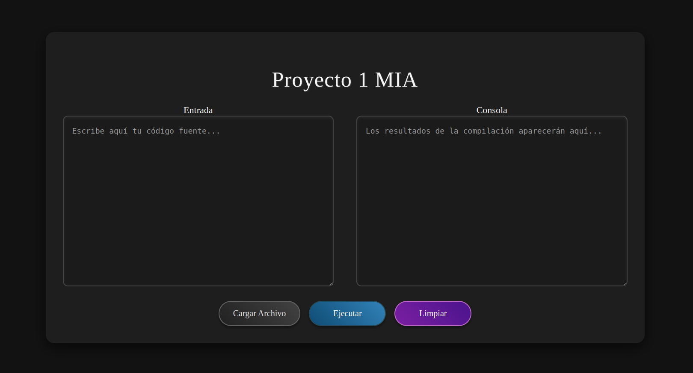
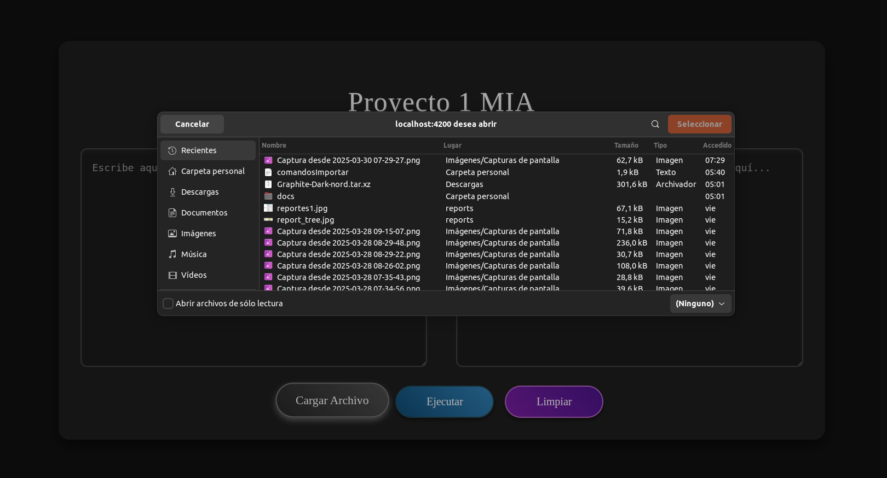
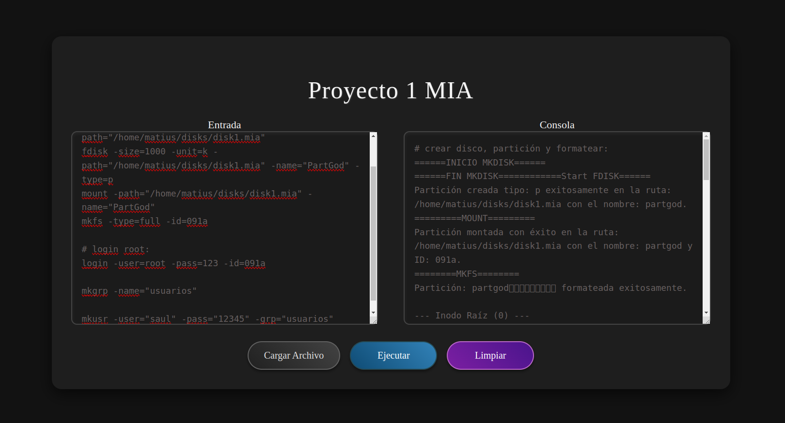
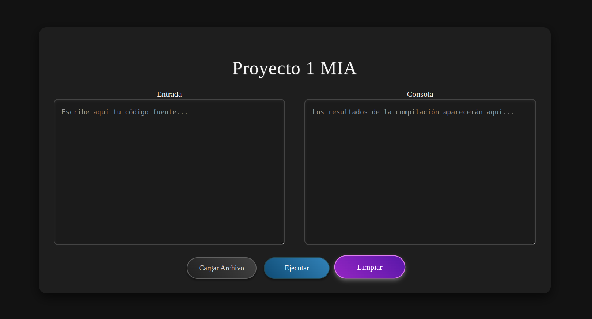

# Manual de Usuario - Proyecto Sistema de archivos

## Índice
1. [Introducción](#introducción)
2. [Requisitos del Sistema](#requisitos-del-sistema)
3. [Instalación](#instalación)
4. [Funciones Principales](#funciones-principales)
    - [1. Pantalla principal](#1-Pantalla-principal)
    - [2. Entrada](#2-Entrada)
    - [3. Cargar Archivo](#3-gestión-de-solicitudes-de-amistad)
    - [4. Ejecutar](#4-Ejecutar)
    - [5. Limpiar](#5-Limpiar)
5. [Guía de Uso](#guía-de-uso)
6. [Consideraciones Finales](#consideraciones-finales)

## Introducción

Este proyecto tiene como objetivo desarrollar una aplicación web para la interacción y gestión de un sistema de archivos EXT2. Esta herramienta web moderna permitirá acceder y administrar el sistema de archivos desde cualquier lugar y en cualquier sistema operativo. En el backend, el sistema de archivos se gestionará en una distribución Linux, que atenderá todas las solicitudes provenientes del frontend.

## Requisitos del Sistema

Antes de instalar y ejecutar el sistema, asegúrate de contar con los siguientes requisitos:

- **Sistema Operativo:** Linux
- **Entorno de Desarrollo:** Visual Studio Code o cualquier IDE compatible con proyectos Go
- **Herramientas adicionales:** Graphviz para la generación de gráficos.

## Instalación

1. **Clona el repositorio o descarga el proyecto:**
   ```bash
   git clone https://github.com/matiuuh/-MIA_1S2025_P1_202203009.git


## Funciones Principales

### 1. Pantalla Principal

Esta pantalla permite al usuario visualizar el entorno de trabajo, el cual se compone por dos cuadros recuadros.

#### Entrada
En este apartado el usuario tiene la opcion de escribir comandos para el funcionamiento del programa, la sintxis del programa tolera entradas como comentarios que empiezan con el simbolo "#".

Asimismo, la entrada tolera multiples lineas de instrucciones, por lo que se permite el ingreso de varios comandos en la misma entrada.

De la misma manera este campo posee una opcion adicional con la que el usuario podra cargar comandos de forma masiva.

#### Consola
En este apartado se muestra la salida de los comandos ejecutados, asi como sus respectivos comentarios.



### 2. Botones

#### 1. Cargar Archivo

Dicho boton posee la funcion de cargar un archivo de texto al sistema, permitiendo la entrada de multiples comandos sin la necesidad de escribirlos.



#### 2. Ejecutar

Con este boton el usuario puede ejecutar los comandos escritos en la entrada, dichos comandos se ejecutan secuencialmente, es decir, en orden.



#### 3. Limpiar

Este boton se encarga de limpiar tanto la entrada como la consola.



## Consideraciones Finales

Este sistema fue diseñado para gestionar eficientemente la creacion de un sistema de archivos.